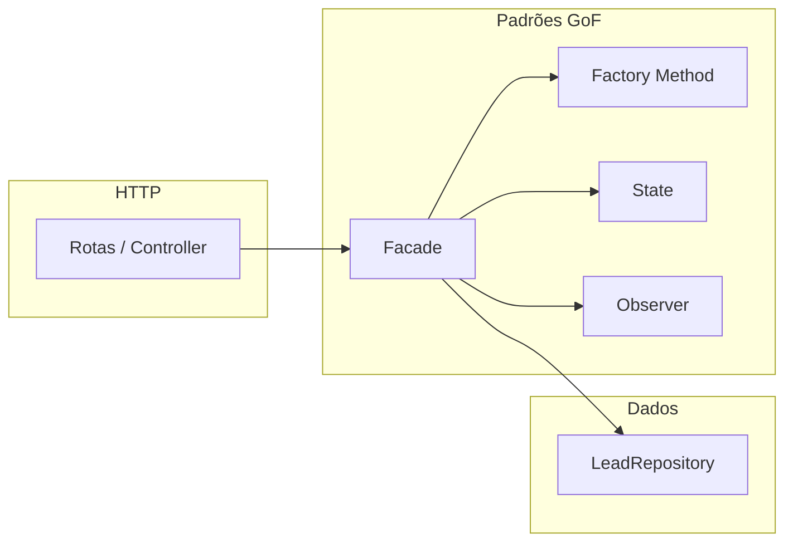

# Padrões Gang of Four (GoF) neste projeto

Este documento explica o que são os padrões **Gang of Four**, por que são úteis e **como** eles aparecem na API de leads (TPII).

---

## O que é o “Gang of Four”?

**Gang of Four** refere-se ao livro clássico *Design Patterns: Elements of Reusable Object-Oriented Software* (Gamma, Helm, Johnson, Vlissides, 1994). O livro catalogou **23 padrões de projeto** — soluções recorrentes para problemas de modelagem em sistemas orientados a objetos.

Os autores agruparam os padrões em três famílias:

| Família        | Foco principal |
|----------------|----------------|
| **Criacionais** | Como objetos são criados sem acoplar o código a classes concretas específicas. |
| **Estruturais** | Como classes e objetos se combinam para formar estruturas maiores. |
| **Comportamentais** | Como objetos colaboram e como responsabilidades são distribuídas. |

Usar esses padrões **não** é um fim em si: o objetivo é **clareza**, **manutenção** e **baixo acoplamento** onde o problema justifica a estrutura extra.

---

## Por que usar GoF nesta API?

Nesta aplicação, os padrões GoF foram escolhidos para:

1. **Separar responsabilidades** — HTTP, persistência em memória, regras de negócio e notificações ficam em camadas distintas.
2. **Encapsular regras complexas** — transições de estágio e de status sem `if`/`switch` gigantes espalhados.
3. **Facilitar extensão** — novos canais de origem ou novos observadores (ex.: integração futura) sem reescrever o núcleo da aplicação.
4. **Oferecer um ponto único de orquestração** — o controller fica fino e a lógica composta fica atrás de uma interface estável.

A seguir, cada padrão **GoF** adotado no código é descrito com **onde** está e **como** se encaixa no fluxo.

---

## Padrões GoF utilizados

### 1. Factory Method (Criacional)

**O que é:** Um método (ou operação) delega a criação de um objeto a subclasses, permitindo que o tipo concreto do produto varie sem alterar o código cliente que só conhece a abstração.

**Por que aqui:** A criação de uma `Lead` depende do **canal de origem** (`visita presencial`, `telefone`, `whatsapp`, `instagram`). Cada canal pode, no futuro, ter particularidades na construção; o Factory Method concentra a criação e fixa estágio/status iniciais de forma uniforme.

**Como foi usado:**

- Classe abstrata `LeadFactory` define `factoryMethod` e `criarLead`.
- Subclasses (`VisitaPresencialLeadFactory`, `TelefoneLeadFactory`, etc.) fixam o campo `canal`.
- A função `obterFabricaPorCanal` resolve qual fábrica usar a partir do canal validado.

Arquivo principal: `src/factory/LeadFactory.ts`.

**Fluxo resumido:** o `LeadFacade` valida o DTO, gera `id` no repositório, obtém a fábrica pelo canal e chama `criarLead` — o restante da aplicação não precisa montar o objeto `Lead` manualmente campo a campo.

---

### 2. Facade (Estrutural)

**O que é:** Uma classe que oferece uma **interface simples** para um subsistema mais complexo (várias classes colaborando entre si).

**Por que aqui:** Criar lead, listar, buscar por id e atualizar negociação envolvem repositório, fábrica, estados da negociação e emissor de eventos. O controller HTTP não deve conhecer essa orquestração.

**Como foi usado:**

- `LeadFacade` expõe métodos de alto nível: `criarLead`, `listarLeads`, `obterLeadPorId`, `atualizarNegociacao`.
- Internamente compõe `LeadRepository` e `LeadEventEmitter` (injetados no construtor).
- Centraliza validações de negócio e chama `resolveNegociacaoState` e `eventEmitter.emitLeadNegociacaoAlterada` quando aplicável.

Arquivo principal: `src/facade/LeadFacade.ts`.

**Montagem:** em `src/app.ts`, instanciam-se repositório, emissor, observador e a fachada; as rotas recebem apenas a `LeadFacade`.

---

### 3. Observer (Comportamental)

**O que é:** Define uma dependência um-para-muitos entre objetos: quando um muda de estado, todos os dependentes são notificados automaticamente.

**Por que aqui:** Quando estágio ou status de uma lead muda (após um `PATCH` bem-sucedido), é desejável **reagir** sem acoplar a regra de atualização a um único destino (hoje o console; amanhã poderia ser fila, banco de log, etc.).

**Como foi usado:**

- Interface `LeadObserver` com `onLeadNegociacaoAlterada(payload)`.
- `LeadEventEmitter` mantém uma lista de observadores e os notifica em `emitLeadNegociacaoAlterada`.
- `LogObserver` é o observador concreto que imprime a linha `[HISTÓRICO]` no console.

Arquivos: `src/patterns/observer/LeadObserver.ts`, `EventEmitter.ts`, `LogObserver.ts`.

**Gatilho:** `LeadFacade.atualizarNegociacao` emite o evento **somente** se estágio ou status efetivamente mudou.

---

### 4. State (Comportamental)

**O que é:** Permite que um objeto altere seu comportamento quando seu estado interno muda; o objeto parece mudar de classe. Aqui o “estado” modela o **estágio da negociação** e as regras de transição associadas.

**Por que aqui:** As regras “só avançar um estágio por vez”, “não retroceder” e “lead finalizada não muda estágio” ficam **localizadas** em classes de estado em vez de um único método cheio de condicionais.

**Como foi usado:**

- Interface `NegociacaoState` com `assertTransicaoEstagioPermitida(lead, novoEstagio)`.
- Implementações por estágio: `ContatoInicialState`, `EnviouPropostaState`, `AguardandoRespostaState`, `AguardandoPagamentoState`, `FinalizadoState`.
- `resolveNegociacaoState(lead)` escolhe a instância correta com base no estágio atual (e trata lead finalizada com `FinalizadoState`).

Arquivos: `src/patterns/state/*.ts`, em especial `NegociacaoState.ts` e `resolveNegociacaoState.ts`.

**Integração:** `LeadFacade.atualizarNegociacao` resolve o estado e chama `assertTransicaoEstagioPermitida` antes de persistir; transições de **status** permanecem na própria fachada (`assertTransicaoStatusPermitida`), o que combina bem com o State focado no **estágio**.

---

## O que *não* é GoF no catálogo original (mas aparece no projeto)

Para evitar confusão acadêmica:

| Elemento no código | Observação |
|--------------------|------------|
| **`LeadRepository`** | O projeto documenta como **repositório em memória** para isolar persistência. O nome “Repository” é um padrão muito usado em DDD/camadas de dados, **não** consta nos 23 padrões do livro GoF. |
| **Controller Express** | Camada HTTP fina; não é um padrão GoF nomeado, apenas boa separação em camadas. |
| **Composição em `app.ts`** | *Dependency Injection* manual simples (construir objetos e passar dependências); útil, mas não é um dos 23 nomes GoF. |

Isso não diminui o repositório ou o controller: apenas deixa claro **o que** entra no relatório “GoF” estrito **versus** outras boas práticas de arquitetura.

---

## Visão geral da arquitetura (fluxo)

Em uma requisição típica de criação de lead: **Controller → Facade → Factory Method + Repository**. Em atualização de negociação: **Facade → State (estágio) + regras de status + Repository → Observer (se houve mudança)**.

---

## Referência rápida de arquivos

| Padrão GoF      | Arquivo(s) principais |
|-----------------|------------------------|
| Factory Method  | `src/factory/LeadFactory.ts` |
| Facade          | `src/facade/LeadFacade.ts` |
| Observer        | `src/patterns/observer/EventEmitter.ts`, `LeadObserver.ts`, `LogObserver.ts` |
| State           | `src/patterns/state/*.ts` |
| Composição raiz | `src/app.ts` |

---

## Leitura sugerida

- Gamma, E.; Helm, R.; Johnson, R.; Vlissides, J. *Design Patterns: Elements of Reusable Object-Oriented Software*. Addison-Wesley, 1994.

Para consulta online resumida, a [Wikipedia em inglês sobre Design Patterns](https://en.wikipedia.org/wiki/Design_Patterns) costuma listar os 23 padrões com links para cada um.
